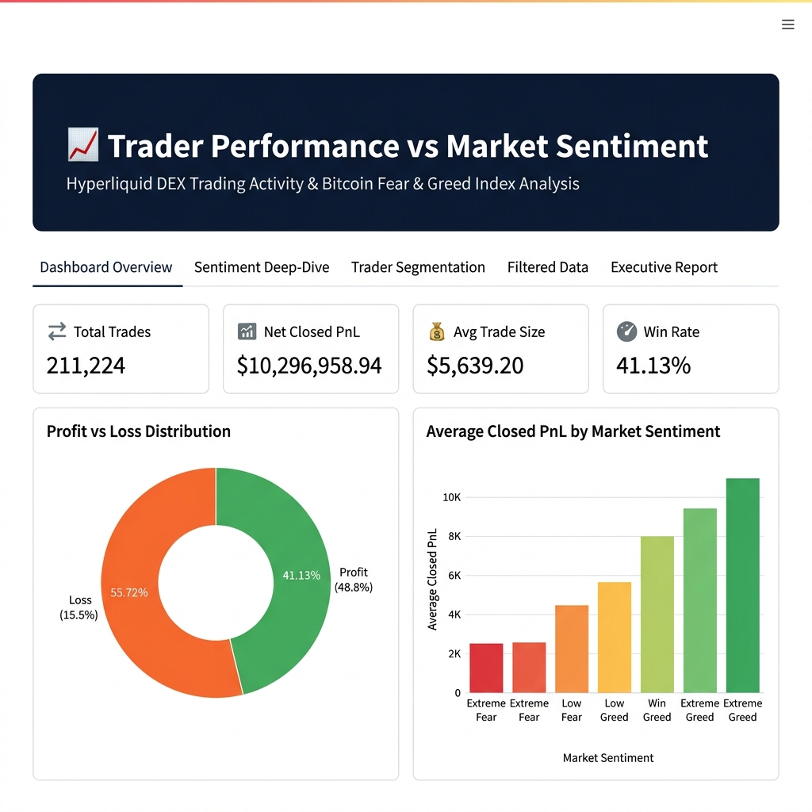

# 📈 Trader Performance vs. Market Sentiment Analysis

[](http://localhost:8501)
[](https://python.org)
[](https://opensource.org/licenses/MIT)

An end-to-end data science project analyzing the relationship between **Bitcoin market sentiment** (as measured by the Crypto Fear & Greed Index) and **trader performance on the Hyperliquid decentralized exchange (DEX)**.

This repository serves as a professional assessment for the **Data Science Internship** role at **Primetrade.ai**.

---

## 🖥️ Streamlit Dashboard Preview

Here is an overview of the interactive dashboard built to visualize the trader performance:



---

## 📌 Project Overview & Key Findings

Through a comprehensive analysis of **211,224 individual trades** executed by **32 unique accounts** from 2018 to 2026, we discovered several high-alpha behavioral patterns and market anomalies:

*   **Asymmetric Payoffs (High Risk-Reward):** The network of traders generated **$10,296,958.94** in net profit, despite a trade-level win rate of **41.13%**. This is driven by a massive risk-to-reward ratio: the average winning trade (**$152.48**) is **6.43x larger** than the average losing trade (**-$23.71**).
*   **Shorting Alpha during Retail Euphoria:** SELL (short) trades exhibit a **58.98% win rate** and an average PnL of **$114.58 per trade** during **Extreme Greed** periods. Conversely, BUY (long) trades during Extreme Greed generate only **$10.50 per trade** with a **31.14% win rate**.
*   **Counter-Cyclical Position Sizing:** Successful traders scale up their average trade sizes during **Fear** regimes (**$7,816**) and scale down exposure to their lowest levels during **Extreme Greed** (**$3,112**).
*   **Execution Frequency Correlates with Consistency:** High-frequency traders (averaging >15,000 trades) are **100% profitable**, demonstrating that systematic execution is key to extracting alpha on Hyperliquid.

For a deeper dive into the methodology, data tables, and strategy recommendations, read the [Professional Summary Report](report/Summary_Report.md).

---

## 📂 Repository Structure

```directory
Trader_Performance_vs_Market_Sentiment/
├── data/                                 # Source CSV Datasets
│   ├── fear_greed_index.csv              # Bitcoin Fear & Greed Index history
│   └── historical_data.csv               # Hyperliquid trade logs (47 MB)
├── notebooks/                            # Jupyter Notebooks for analysis
│   └── Trader_Performance_vs_Market_Sentiment.ipynb # Completed & fully executed notebook
├── charts/                               # Generated analysis charts
│   ├── sentiment_distribution.png
│   ├── pnl_distribution.png
│   ├── avg_pnl_by_sentiment.png
│   ├── profit_loss_distribution.png
│   ├── win_rate_by_sentiment_and_side.png
│   ├── pnl_by_sentiment_and_side.png
│   ├── trader_segmentation_scatter.png
│   └── cumulative_pnl_over_time.png
├── screenshots/                          # Dashboard screenshots
│   ├── dashboard_overview.png
│   ├── sentiment_deep_dive.png
│   ├── trader_segmentation.png
│   ├── filtered_data.png
│   └── executive_report.png
├── report/                               # Final reports & summaries
│   └── Summary_Report.md                 # Professional markdown report
├── app.py                                # Polished Streamlit Dashboard
├── requirements.txt                      # Python library dependencies
└── README.md                             # Project documentation
```

---

## 🛠️ Installation & Setup

Follow these steps to run the dashboard and exploration environment locally:

### 1. Clone the Repository
```bash
git clone https://github.com/AtharvDhiman/Trader-Performance-vs-Market-Sentiment.git
cd Trader-Performance-vs-Market-Sentiment
```

### 2. Set Up a Virtual Environment
```bash
# Create a virtual environment
python -m venv .venv

# Activate the virtual environment
# On Windows (Command Prompt):
.venv\Scripts\activate
# On Windows (PowerShell):
.venv\Scripts\Activate.ps1
# On macOS/Linux:
source .venv/bin/activate
```

### 3. Install Dependencies
```bash
pip install -r requirements.txt
```

### 4. Run the Streamlit Dashboard
```bash
streamlit run app.py
```
The application will open automatically in your browser at `http://localhost:8501`.

---

## 📊 Core Features of the Dashboard

*   **Tab 1: Dashboard Overview:** Overall KPIs (Total Trades, Net PnL, Win Rate, Volume, Fees) and distribution plots for PnL, top coins, and daily trading volumes.
*   **Tab 2: Sentiment Deep-Dive:** Interactive bar charts showing how PnL and win rates vary by side (BUY vs. SELL) across different sentiment regimes.
*   **Tab 3: Trader Segmentation:** Scatter plot and tables grouping the 32 traders by frequency (Low, Medium, High) showing their success rates and leaderboards.
*   **Tab 4: Filtered Data:** Interactive table allowing custom filtering by Sentiment, Coin, and Trade Side with a CSV download utility.
*   **Tab 5: Executive Report:** Fully integrated, beautifully formatted markdown copy of the final assessment report.

---

## 🛠️ Technology Stack

*   **Core Logic & Analytics:** Python 3.13, Pandas, NumPy
*   **Visualizations:** Plotly Express (Interactive), Seaborn, Matplotlib (Static)
*   **Web Framework:** Streamlit
*   **Development Environment:** Jupyter Notebook
*   **Screenshot Automation:** Selenium WebDriver (Headless Chrome)

---

## 👤 Developer Information

*   **Name:** Atharv Dhiman
*   **Role:** Data Science Internship Candidate
*   **Assessment For:** Primetrade.ai
