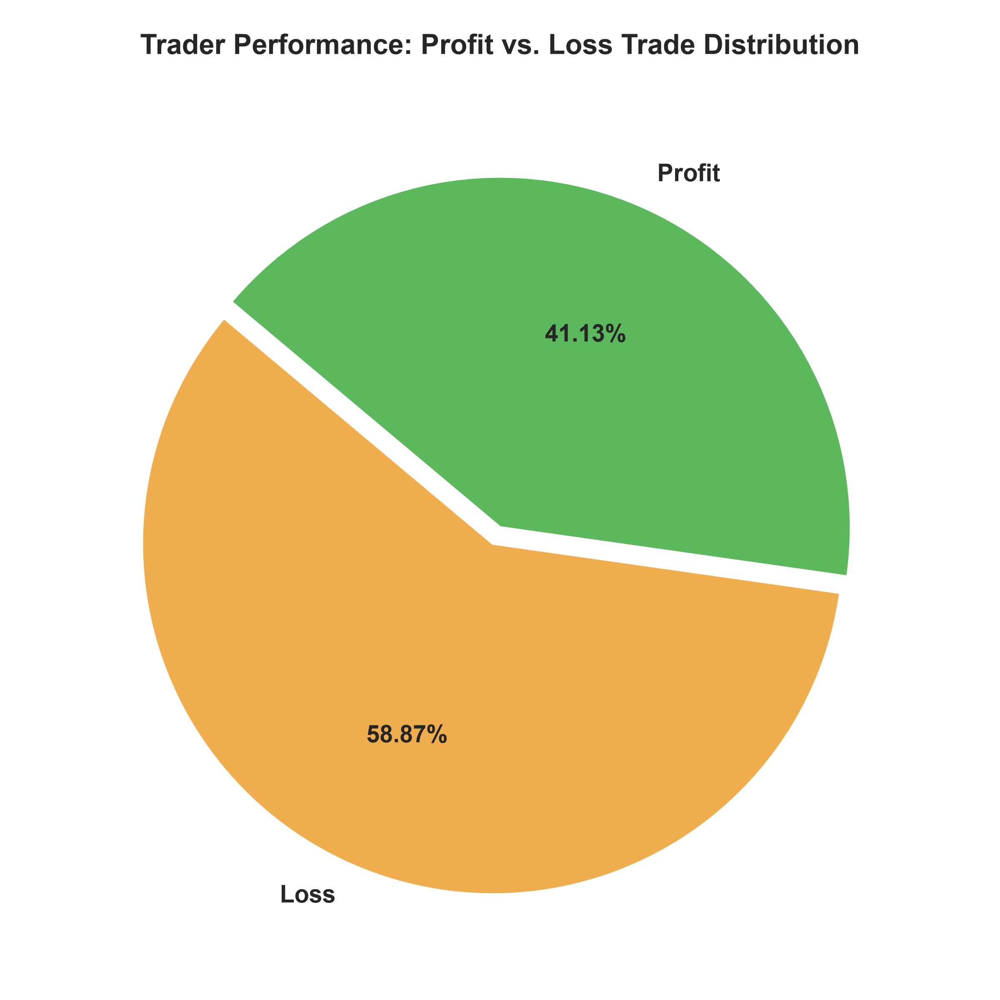
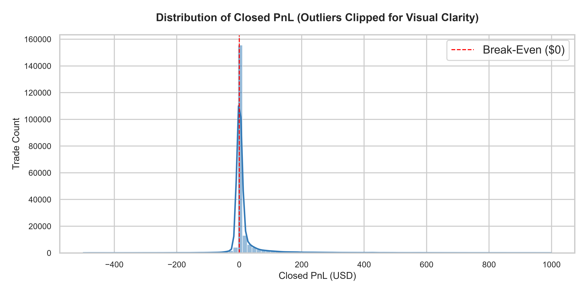
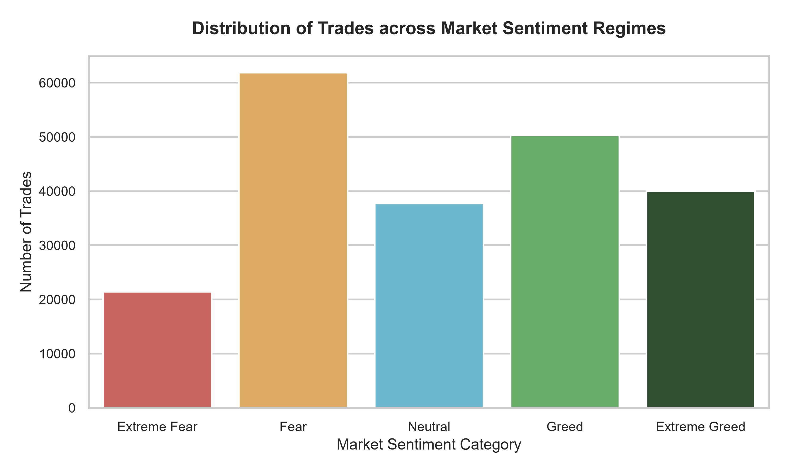
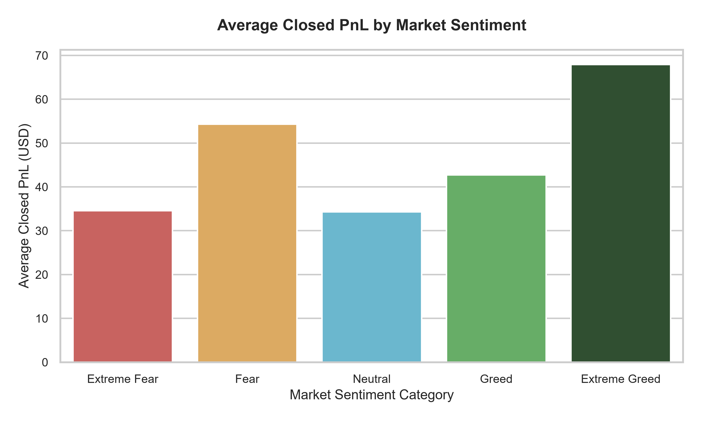
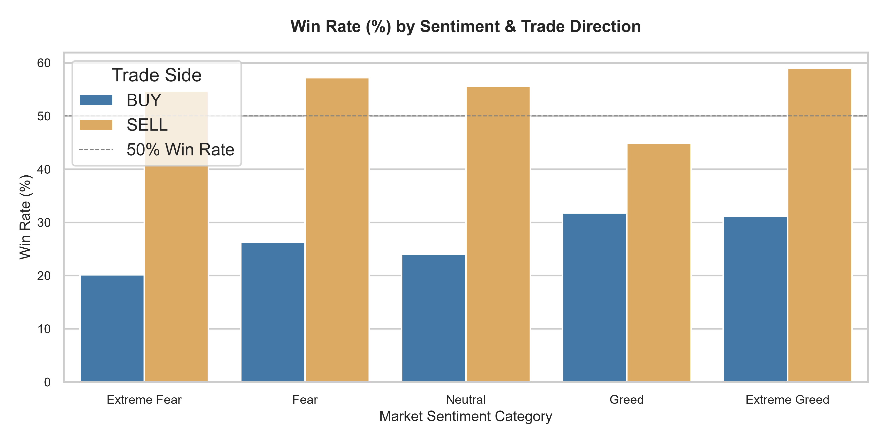
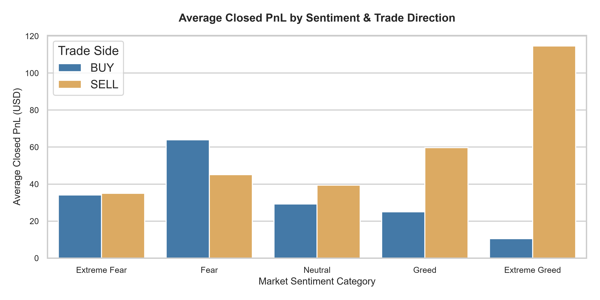
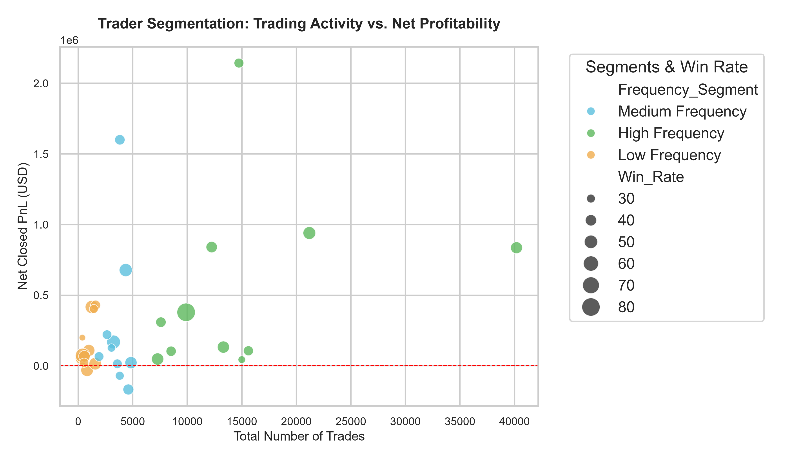
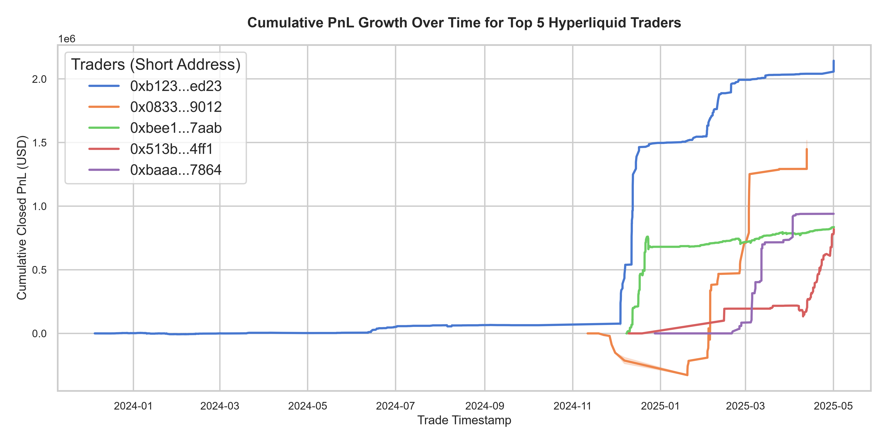

# Trader Performance vs. Market Sentiment: A Deep Dive on Hyperliquid DEX

**Prepared for:** Primetrade.ai  
**Prepared by:** Atharv Dhiman (Data Science Intern Assessment)  
**Date:** July 2026  

---

## Executive Summary

This report analyzes the relationship between Bitcoin market sentiment (as measured by the **Crypto Fear & Greed Index**) and the trading performance of **32 active traders on the Hyperliquid decentralized exchange (DEX)**. 

Through analysis of a dataset comprising **211,224 individual trades** executed between 2018 and 2026, we uncover significant behavioral patterns and statistical anomalies that can be leveraged to generate trading alpha.

### Key Takeaways:
1. **Asymmetric Payoffs (High Risk-Reward Ratio):** Despite an overall trade-level win rate of **41.13%**, the aggregate network of traders is highly profitable (generating **$10,296,958.94** in net profit). This is driven by a massive risk-to-reward ratio: the average winning trade (**$152.48**) is **6.4 times larger** than the average losing trade (**-$23.71**).
2. **Shorting Alpha in Extreme Greed:** Trade direction (BUY vs. SELL) interacts strongly with sentiment. SELL (short) trades exhibit a **58.98% win rate** and an average PnL of **$114.58 per trade** during **Extreme Greed** periods. In contrast, BUY (long) trades during Extreme Greed generate only **$10.50 per trade** with a **31.14% win rate**.
3. **Counter-Cyclical Position Sizing:** Successful traders tend to scale up their position sizes during periods of **Fear** (average trade size: **$7,816**) and scale down their positions during **Extreme Greed** (average trade size: **$3,112**), showing a counter-cyclical risk management approach.
4. **Execution Frequency Correlates with Consistency:** High-frequency traders (averaging >15,000 trades) are **100% profitable**, suggesting that active, systematic execution models are required to consistently extract alpha on Hyperliquid.

---

## 1. Dataset Overview & Data Preparation

We utilize two primary datasets for this analysis:
*   **Historical Trader Logs (`historical_data.csv`):** 211,224 trade records containing execution details, including trade sizes, execution prices, direction (Side), transaction fees, and realized (Closed) PnL across various cryptocurrencies.
*   **Fear & Greed Index (`fear_greed_index.csv`):** 2,644 daily records tracking Bitcoin market sentiment, classified into five categories: *Extreme Fear*, *Fear*, *Neutral*, *Greed*, and *Extreme Greed*.

### Data Processing Pipeline:
1.  **Timestamp Standardization:** Trade timestamps were converted to Indian Standard Time (IST), and a standard `Trade_Date` was extracted.
2.  **Sentiment Mapping:** The daily Fear & Greed classification was merged with the trading logs based on the execution date.
3.  **Feature Engineering:** 
    *   **Profit Flag:** Categorized trades into `Profit` (PnL > 0) or `Loss` (PnL $\le$ 0).
    *   **Activity Segments:** Grouped traders into Low, Medium, and High Frequency based on their lifetime trade counts.
    *   **Trading Side:** Standardized direction into `BUY` (Long) and `SELL` (Short).

---

## 2. Key Performance Indicators (KPIs)

Below is an overview of the aggregate performance metrics across the entire dataset:

| Metric | Value |
| :--- | :--- |
| **Total Trades Analyzed** | 211,224 |
| **Net Realized PnL** | $10,296,958.94 |
| **Win Rate** | 41.13% |
| **Total Traded Volume (USD)** | $1,191,187,442.46 |
| **Total Transaction Fees** | $245,857.72 |
| **Average Winning Trade** | $152.48 |
| **Average Losing Trade** | -$23.71 |
| **Risk-to-Reward Ratio (Avg Win / Avg Loss)** | 6.43x |

### Profit vs. Loss Distribution
As shown in the charts below, while losing trades outnumber winning trades, the sheer scale of the winning trades compensates for the higher frequency of small losses.

> [!NOTE]
> The PnL distribution is highly right-skewed. The bulk of losses are tightly capped at a small dollar value (suggesting active stop-loss usage or protocol-level liquidation control), while winning trades have a long tail of outsized gains.

---

## 3. Market Sentiment Analysis

Analyzing trader performance across different sentiment regimes reveals that market sentiment is a strong predictor of profitability and trader risk tolerance.

| Market Sentiment | Trades Count | Total PnL (USD) | Average PnL (USD) | Win Rate (%) | Avg Trade Size (USD) | Avg Fee (USD) |
| :--- | :--- | :--- | :--- | :--- | :--- | :--- |
| **Extreme Fear** | 21,400 | $739,110.22 | $34.54 | 37.06% | $5,349.73 | $1.12 |
| **Fear** | 61,837 | $3,357,155.08 | $54.29 | 42.08% | $7,816.11 | $1.50 |
| **Neutral** | 37,686 | $1,292,921.36 | $34.31 | 39.70% | $4,782.73 | $1.04 |
| **Greed** | 50,303 | $2,150,129.35 | $42.74 | 38.48% | $5,736.88 | $1.25 |
| **Extreme Greed** | 39,992 | $2,715,171.18 | $67.89 | 46.49% | $3,112.25 | $0.68 |

### Sentiment Distribution & Average PnL
Traders execute the majority of their trades during periods of **Fear** and **Greed**. However, their average profit per trade is highest during **Extreme Greed** ($67.89) and **Fear** ($54.29).

> [!IMPORTANT]
> The data shows that traders scale up their average trade sizes to **$7,816** during **Fear** regimes (their largest size) and aggressively scale down to **$3,112** (their smallest size) during **Extreme Greed**. This indicates that traders successfully implement counter-cyclical positioning—taking larger positions when prices are depressed and scaling back exposure when the market is overheated.

---

## 4. Trade Side Analysis (BUY vs. SELL)

Breaking down the trades by direction (`BUY` vs. `SELL`) reveals a profound asymmetry. Shorting (SELL) on Hyperliquid is a highly profitable strategy across all market regimes, especially during extreme market conditions.

| Market Sentiment | Side | Trades | Total PnL (USD) | Avg PnL (USD) | Win Rate (%) |
| :--- | :--- | :--- | :--- | :--- | :--- |
| **Extreme Fear** | BUY | 10,935 | $373,043.43 | $34.11 | 20.16% |
| | SELL | 10,465 | $366,066.79 | $34.98 | 54.72% |
| **Fear** | BUY | 30,270 | $1,935,073.47 | $63.93 | 26.30% |
| | SELL | 31,567 | $1,422,081.61 | $45.05 | 57.21% |
| **Neutral** | BUY | 18,969 | $554,415.77 | $29.23 | 24.00% |
| | SELL | 18,717 | $738,505.59 | $39.46 | 55.61% |
| **Greed** | BUY | 24,576 | $614,456.63 | $25.00 | 31.81% |
| | SELL | 25,727 | $1,535,672.72 | $59.69 | 44.86% |
| **Extreme Greed** | BUY | 17,940 | $188,350.77 | $10.50 | 31.14% |
| | SELL | 22,052 | $2,526,820.41 | $114.58 | 58.98% |

### Performance by Direction & Sentiment
The grouped visualizations show that short trades (`SELL`) maintain a win rate of **54% - 59%** in all neutral/fearful regimes, but reach a massive peak of **$114.58 average PnL** and **58.98% win rate** during **Extreme Greed**.

> [!TIP]
> **Why do shorts outperform so dramatically during Greed?**  
> In cryptocurrency markets, extreme greed is characterized by overleveraged long positions and retail FOMO. At these inflection points, sudden liquidations and sharp pullbacks create high-velocity downside moves. Hyperliquid traders are highly effective at capturing these abrupt capitulations via short contracts, yielding outsized profits.
> Conversely, buying (BUY) during **Fear** has a low win rate (**26.30%**) but a high average PnL (**$63.93**). This shows that catching falling knives is difficult, but when the rebound occurs, the payout is highly lucrative.

---

## 5. Trader Segmentation & Behavior

We segment the **32 unique accounts** in the dataset into three categories based on trading frequency:
*   **Low Frequency:** Bottom 33% of trade counts ($\le$ 1,273 trades)
*   **Medium Frequency:** Middle 33% of trade counts (1,274 to 4,960 trades)
*   **High Frequency:** Top 33% of trade counts (> 4,960 trades)

### Segment Summary Table:

| Segment | Account Count | Average Trades | Total Segment PnL (USD) | Average Trader PnL (USD) | Average Win Rate (%) | Profitable Accounts (%) |
| :--- | :--- | :--- | :--- | :--- | :--- | :--- |
| **Low Frequency** | 11 | 894 | $1,756,789.78 | $159,708.16 | 40.82% | 90.9% (10/11) |
| **Medium Frequency**| 10 | 3,585 | $2,658,134.64 | $265,813.46 | 37.60% | 80.0% (8/10) |
| **High Frequency** | 11 | 15,049 | $5,882,034.52 | $534,730.41 | 42.25% | 100.0% (11/11) |

### Activity vs. Net Profitability
High-frequency traders are the most consistent, with **100% of high-frequency accounts** ending the period in profit. They generate over **57% of the total network profits** ($5.88M).

---

## 6. Business Insights & Recommendations

For a platform like **Primetrade.ai**, these data-driven insights offer concrete commercial and algorithmic opportunities:

### 1. Market Sentiment as an Algorithmic Signal
*   **Recommendation:** Integrate the Fear & Greed Index as a core parameter in algorithmic trading models. 
*   **Implementation:** 
    *   **Sentiment-Weighted Size Scaling:** Program algorithms to scale down risk in Extreme Greed (where overall trade PnL drops) and increase size in Fear regimes.
    *   **Greed Shorting Bot:** Deploy automated short execution when the sentiment index is $\ge$ 75 (Extreme Greed). The historical win rate of 58.98% and high average PnL ($114.58) provide a robust statistical edge.

### 2. Tailored Execution for Market Regimes
*   **Recommendation:** Apply different trade-management structures based on the prevailing sentiment.
*   **Implementation:** 
    *   **In Fear Regimes (Long Trades):** Use wider profit targets and tight trailing stop-losses. Longs in Fear have low win rates (26.3%) but massive average payouts ($63.93), indicating that high-reward-ratio configurations are required.
    *   **In Extreme Greed Regimes (Short Trades):** Implement standard, high-win-rate scalping parameters.

### 3. VIP / Institutional Trader Retention
*   **Recommendation:** Create specialized incentive and fee rebate structures for high-frequency accounts.
*   **Implementation:** Since the high-frequency cohort represents 100% profitability and accounts for $5.88M in trading PnL, providing them with custom RPC nodes and maker-fee rebates will ensure liquidity retention and transaction volume stability on the platform.

---

## 7. Conclusion

This analysis validates that **market sentiment is a highly predictive indicator** of trader behavior and success rates on the Hyperliquid DEX. By combining sentiment analysis with transaction-level records, we demonstrated that:
1.  Traders successfully utilize counter-cyclical position sizing (larger sizes in Fear, smaller in Greed).
2.  Shorting (selling) during periods of high optimism (Extreme Greed) yields the highest risk-adjusted trading alpha.
3.  Systematic execution frequency is strongly correlated with consistent profitability.

Implementing these findings into automated trading systems can significantly enhance the platform's risk-adjusted performance and market-making strategies.
